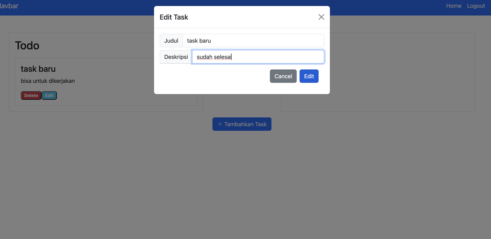
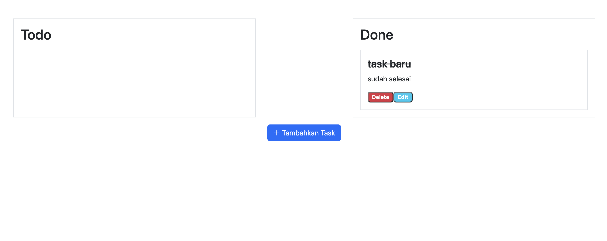
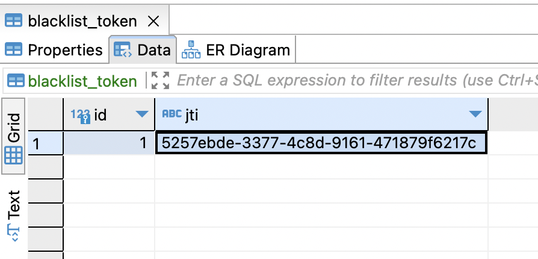

# TODO-app-Project

TODO app used python as main programming language, sqlite database and basic frontend with html and bootstrap

### A. Background

Todo app system is a program to manage our daily activities so our task will be easier to be tracking. the system can serve many users and every user have own credential so the task will only show to the creator.

### B. Objective

Program objective:

- Create New User
- Login User
- Logout User
- Create Task by user
- Edit Task by user
- Delete task by user
- Update Task Status by user

Learning objective:

- Create programming language with python and connected to sqlite database.
- Implement application with Flask and orm sqlalchemy.
- Implement Security token with JWT.
- Modular script with blueprint flask.

### C. Tools

Languages:

- Python
- SQLite
- html 
- bootstrap

Libraries: 

- Sqalchemy
- Flask
- Flask-JWT

### D. Program Description

1. Create SQLite Database with Library Sqlalchemy

- Create DB  containing 3 tables
- Table 1 - users: Contain user information 
- Table 2 - tasks: Contain task mapping by user_id
- Table 3 - blacklist_token: Contain destroy access token
- Output: todo.sqlite


_Picture 1: ERD for DB TODO app_

2. Create TODO app Program


_Diagram 1: Flowchart Program_

### E. Directory Structure


_Picture 1: Directory Structure_  

- auth: service to handle auth 
- frontend: service to render template and consume API
- static/js: script js for running logic and embeded in html
- models: connection to database with orm sqlalchemy
- task: service to handle task
- templates: html file
- user: service to handle user
- migrations: db version 
- todo/app.db: sqlite db file based
- config: store configuration
- requirements.txt: dependecies

### F. Setup

1. Clone this git repository into your local computer. https://github.com/agnynureza/flask-todo-app
2. Install dependency:
    ```
    pip install -r "requirements.txt"
    ```
3. First time you need to running database, it will create folder migration:
    ```
    flask db init
    ```
3. register the migration file:
    ```
    flask db migrate -m "optional"
    ```
3. commit migration file:
    ```
    flask db upgrade
    ```
4. Running app:
    ```
    flask run --debug
    click http://127.0.0.1:5000 
    redirect to browser
    ```

### G. Test Cases & Results

__Test case 1: Register and Login New User__

- 1.A: Register


- 1.B: Login


__Test case 2: Home Page__

- 2.A: Home


__Test case 3: Create Task__ 

- 3.A: Create, Edit, Update Status New Task 


- 3.B: Edit task


- 3.C: Update Status Task

    
__Test case 4: Delete Task__ 

- 4.A: Delete Task


__Test case 5: Logout__

- 5.A: Delete token


- 5.A: Redirect to Login Page

